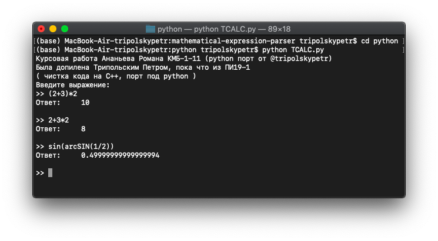

# СИНТАКСИЧЕСКИЙ АНАЛИЗ ВЫРАЖЕНИЯ. ПАРСЕР МАТЕМАТИЧЕСКИХ ВЫРАЖЕНИЙ

> В этой курсовой работе я реализовал возможность получения от пользователя строку с арифметическим выражением, содержащим арифметические операции и скобки, а в ответ вывод результата вычислений.

### В данной программе были реализованы следующие возможности:
* Работа с основными математическими операциями (+ - * /)
* Работа со специфическими функциями (%, sqrt, ^)
* Работа с тригонометрическими функциями (sin, cos, arcsin, arccos, tg, ctg, arctg, arcctg)
* Работа с гиперболическими функциями (sh, ch, th, cth)
* Обработка функций (lg, ln, e^_)
* Встроенные константы (g=9.81, pi=3.14, e=2.71)

@[aTastyCookie](https://github.com/aTastyCookie)

## Воу, уважаю!

Крутая программа получилась. Правда, оформление кода и отсутствие файла проекта для какой-нибудь системы сборки *моветон*: пофикшено. Так же, запилил порт под **python**, чтобы охватить больше студентов, даешь опенсорс в массы! Его работу можно посмотреть работу онлайн на [Repl.it](https://repl.it/@tripolskypetr/better-mathematical-expression-parser).

@[tripolskypetr](https://github.com/tripolskypetr/)

